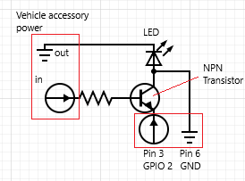

# PyDashCam
Dash cam script for a Raspberry Pi with a webcam  
Compatible with any USB webcam that works with a Raspberry Pi  
I am currrently running this on a Raspberry Pi 2 Model B with a Logitech C615 Webcam (the cheapest I could find)

# Features
- Displays date and time in the video
- Captures up to a certain amount of storage and deletes any videos older than a specified amount of time. Please note that you will need more storage space based on the framerate, video length, and frame dimensions
- This program is designed to be run when the Raspberry Pi turns on. The video is continuously saved as the program runs. If the Raspberry Pi turns off for any reason, the video will be saved, even if the video has not yet reached the maximum length. The Raspberry Pi will be on 24/7, but it will reboot whenever the vehicle turns off.

# Installation
1. Clone the repository
2. Install all of the required libraries using the following commands: 
    - `pip install -r requirements.txt`
    - `sudo apt-get install libopencv-* libqt4-dev`
    - `sudo apt install libgtk2.0-dev pkg-config`
3. Run `sudo nano /etc/rc.local` and above the line `exit 0`, add the command `sudo python /home/pi/PyDashCam/main.py`, or the directory you cloned the repository to. This will make the Raspberry Pi run the script on boot.  
NOTE- in order to edit the rc.local file after this step, you must SSH into the Raspberry Pi because it will not allow you to exit the script
You can manually run the script with `python main.py`, but it will start automatically after running `sudo reboot`

# Vehicle Connection
1. We will need to access the vehicle's accessory power and the always-on power. The lighter socket is a good place to get accessory power, so you can splice a USB cable to get power from that. For the always-on power, you will need to use a fuse tap in the passenger fuse box. This will vary from vehicle to vehicle, so further research may be needed.
2. After getting the necessary power sources, you will need to create a circuit to be used with the GPIO pins on the Raspberry Pi. The circuit is displayed below:
  
  This circuit can be soldered into a HAT for the Raspberry Pi, or a standard PCB board. When current from the vehicle activates the transistor, GPIO 2 will be shorted to ground, which is detected by the script.
  
# Troubleshooting
- Make sure that enough power is supplied to the Raspberry Pi. It will need 5V with at least 2.5A.
